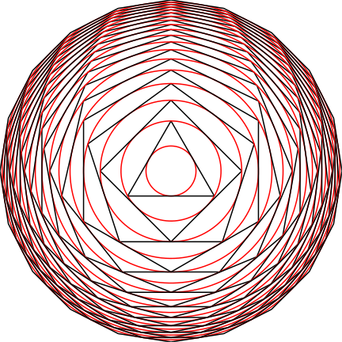
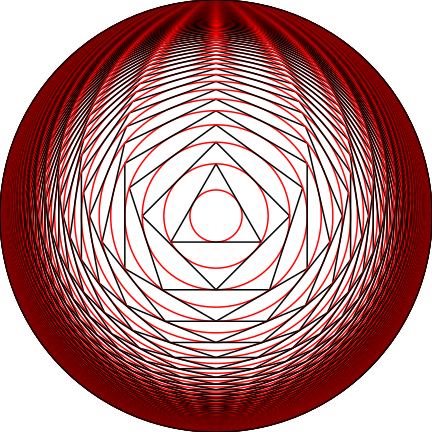

# conc_poly
Generate concentric regular polygons

This code was inspired by a t-shirt print which I wanted to recreate :-) 

The code generates a series of regular polygons with ascending number of sides, each polygon inscribed in a circle which is then inscribed into the next polygon in the series.

Here are examples of how this looks like, starting with the regular triangle and going up to the 20- and 100-sided regular polygon, respectively:  
(if in dark mode, check the example image in the repo instead for better visuals)

 
